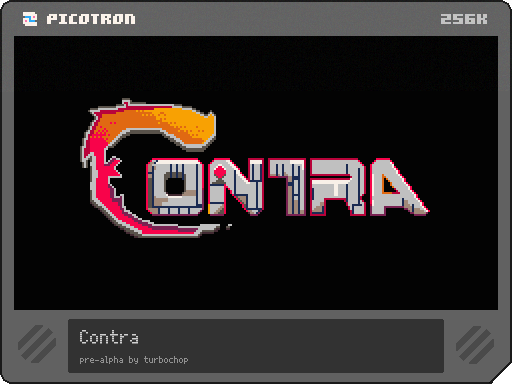

# Contra

A Picotron/Lua Contra-style action prototype by **turbochop**, with graphics work by **reecegames**.

This is an active cartridge project focused on recreating the feel of classic run-and-gun Contra movement, shooting, enemies, powerups, screen flow, and staged level progression inside Picotron.



## Current State

The current build starts with a title screen and level card, then moves into a side-scrolling Jungle stage. Work is also underway on a second top-down Base-style stage.

Implemented or in progress:

- Side-scrolling player movement, jumping, prone/crouch behavior, slope handling, firing, recoil, deaths, respawns, and continues
- Early top-down movement and aiming support
- One-player and two-player start flow
- Enemy runners, turrets, cannons, bullets, capsules, pickups, and effects
- Weapon and powerup systems, including machine gun, rapid, spread, and fire
- Camera logic for horizontal, vertical, and mixed scrolling experiments
- Layered map drawing, map caching, and spawn streaming
- Stage intro wipes, level cards, game over, continue, and end-state scenes

## Running The Project

This repository is a Picotron cartridge/project export. Open it from Picotron as a local project/cart and run the main cartridge entry point.

The current development baseline starts from:

```lua
level_type = "side scrolling"
scrolling = "horizontal"
level = 1
```

Level intro images are selected in `wipe.lua` with `map_helper(...)`.

## Controls

Picotron button numbers are used internally, but the gameplay mapping is:

- Move left/right in side-scrolling stages
- Press down while grounded to go prone, or crouch when on a slope
- Jump
- Fire
- In top-down stages, move and aim with the directional controls

The title flow supports selecting one-player or two-player mode. Player 2 can also join during gameplay when the current state allows it.

## Project Layout

- `main.lua` - boot setup, global state, scene routing, and reset helpers
- `game.lua` - main gameplay update loop, entity updates, bullets, collisions, and level completion flow
- `ply_mod.lua` - player object creation and player drawing
- `ply_common.lua` - shared player behavior such as firing, death, respawn, and movement helpers
- `ply_scode.lua` - side-scrolling player movement, aiming, collision, and animation
- `ply_tdcode.lua` - top-down player movement, aiming, collision, and animation
- `weapons.lua` - player weapons and projectile creation
- `enemies.lua` - enemy objects, enemy bullets, AI, and enemy collision logic
- `powerups.lua` - capsules, pickups, and powerup behavior
- `effects.lua` - explosions, shrapnel, spawners, particles, and other visual effects
- `camera.lua` - camera following and scroll behavior
- `map.lua` - map helpers, cached layer drawing, spawn scanning, and map utilities
- `leveldata.lua` - level setup and stage-specific data
- `cards.lua` - title screen, stage cards, game over, continue, and ending screens
- `wipe.lua` - stage intro wipe setup and transitions
- `collision.lua` - shared collision helpers
- `gfx/` - Picotron graphics data
- `map/` - Picotron map data
- `sfx/` - Picotron sound data

## Development Notes

Recent work includes:

- Crouched-on-slope player graphics when pressing prone on slopes
- Matching player bullet offsets for the crouched slope pose
- Matching enemy bullet collision offsets for the crouched slope posture
- Level 2 map helper updates for the top-down Base intro
- Continued camera, map streaming, and spawn behavior experiments

Useful current references:

```lua
-- main.lua
level_type = "side scrolling"
scrolling = "horizontal"
scroll_dir = "right"

-- wipe.lua
-- level 1: side-scrolling Jungle intro
-- level 2: top-down Base intro
```

## Work In Progress

This is a prototype, so some systems are intentionally still moving around. Areas under active iteration include:

- Slope and collision tuning
- Top-down stage behavior
- Vertical and mixed scrolling support
- Spawn placement and enemy scripting
- Multiplayer edge cases
- Camera polish
- Level pacing and transitions

## Development Notes

This prototype is developed through iterative testing in Picotron. Creative direction, gameplay decisions, and final changes are owned by **turbochop**.

## Credits

- Code and game design: **turbochop**
- Graphics work: **reecegames**
